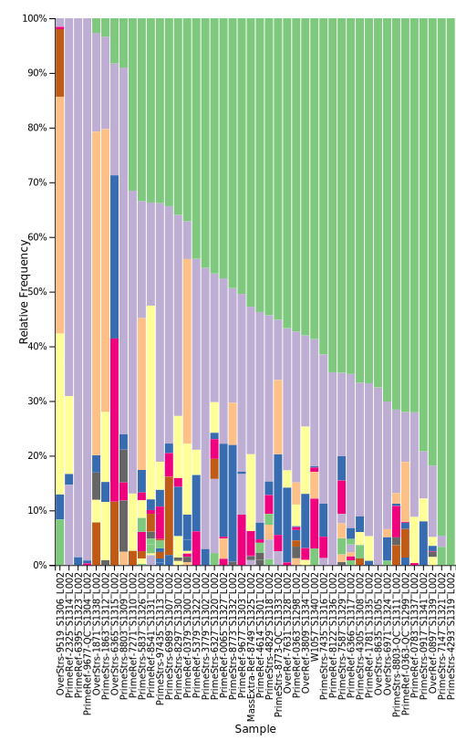
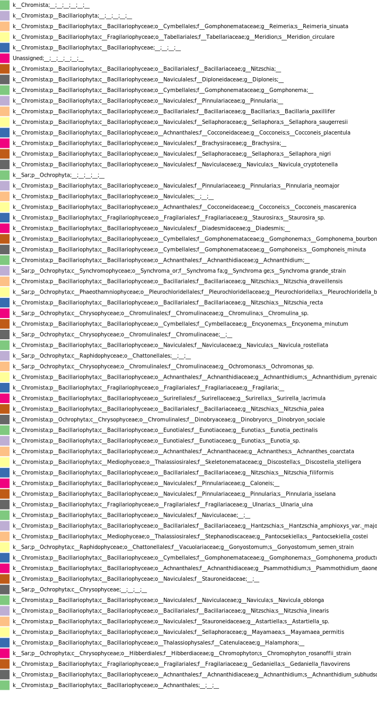

# Diatom Community Analysis Using QIIME2

## Introduction

Diatoms (phylum *Bacillariophyta*) are a diverse group of photosynthetic microalgae that play a critical role in aquatic ecosystems (Medlin, Kooistra, Schmid, 2000). They contribute significantly to primary production and form the base of many food webs. Because diatom communities respond rapidly to changes in environmental conditions, they are widely used as bioindicators of ecosystem health.

Advances in high-throughput sequencing and bioinformatics have enabled detailed characterization of microbial communities, including diatoms, at high taxonomic resolution. Amplicon-based sequencing approaches allow researchers to assess community composition and detect shifts in taxa across environmental gradients.

In this study, diatom community composition was analyzed using paired-end sequencing data processed through a QIIME2-based pipeline. The goal of this analysis was to characterize taxonomic diversity across samples and evaluate differences in community structure that may reflect varying environmental conditions.

---

## Methods

Raw paired-end sequencing reads were first quality-filtered and trimmed using a custom trimming script. The resulting trimmed reads were then imported into QIIME2 using a manifest file specifying forward and reverse read paths.

Demultiplexed sequences were summarized to assess sequencing quality. Denoising was performed using the DADA2 plugin in QIIME2, which filters low-quality reads, corrects sequencing errors, merges paired-end reads, and removes chimeric sequences (Callahan et al., 2016). This process produced a feature table of amplicon sequence variants (ASVs) and a representative sequence file.

Taxonomic classification was conducted using a pre-trained Naive Bayes classifier specific to diatom barcode sequences. Taxonomy assignments were used to generate a taxa barplot visualization, showing the relative abundance of taxa across all samples.

---

## Results

Denoising with DADA2 successfully retained a high proportion of input reads across most samples, with filtering efficiencies generally above 70–80%. A smaller proportion of reads were merged and identified as non-chimeric sequences, resulting in a final dataset suitable for downstream taxonomic analysis.

Taxonomic classification revealed that the majority of sequences belonged to the phylum *Bacillariophyta* (diatoms), with variation in community composition observed across samples. Several genera, including *Navicula*, *Nitzschia*, and *Gomphonema*, were among the most abundant taxa detected.

The taxa barplot demonstrated clear differences in relative abundance patterns among samples, suggesting variability in diatom community structure. Some samples were dominated by a single taxon, while others showed a more even distribution of multiple taxa.

---

## Discussion

The results indicate that diatom community composition varies substantially across samples, likely reflecting differences in environmental conditions such as nutrient availability, salinity, or other ecological factors. The dominance of certain genera in specific samples may suggest localized environmental influences or ecological niches.

The lack of uniform community composition across samples highlights the sensitivity of diatoms as bioindicators. These findings support the use of metabarcoding approaches to assess microbial diversity and monitor ecosystem health.

Future analyses could incorporate environmental metadata to better understand the drivers of community variation. Additionally, further statistical analyses could be performed to quantify differences between sample groups and identify significant patterns in taxonomic composition.

---

## Figure

!## Figure

## References

Callahan, B. J., McMurdie, P. J., Rosen, M. J., Han, A. W., Johnson, A. J. A., & Holmes, S. P. (2016). DADA2: High-resolution sample inference from Illumina amplicon data. Nature methods, 13(7), 581-583.

Medlin, L., Kooistra, W. H., & Schmid, A. M. (2000). A review of the evolution of the diatoms-a total approach using molecules, morphology and geology.